# Tugas Praktikum Sistem Cerdas Image-Classification

## Latar Belakang

Image classification adalah suatu teknik dalam machine learning yang digunakan untuk mengidentifikasi dan mengklasifikasikan objek atau gambar ke dalam beberapa kategori atau label yang telah ditentukan sebelumnya. Teknik ini umumnya dilakukan dengan menggunakan algoritma Deep Learning, seperti Convolutional Neural Network (CNN), yang dilatih dengan data gambar yang telah dilabeli sebelumnya. Setelah dilatih, model CNN dapat digunakan untuk memprediksi label atau kategori dari gambar yang baru dengan tingkat akurasi yang tinggi. Teknik ini memiliki banyak aplikasi, seperti pengenalan wajah, deteksi objek, identifikasi tanda lalu lintas, klasifikasi citra medis, dan lain sebagainya.

### Nama Mahasiswa

1. M. Riyan Hidayatulloh (21220003)

<br/>
<br/>

## Running

manually by running:

```bash
> Python "namafile".py
```

ikuti kode dibawah kemudian nanti akan ada file "model1_cifar_10epoch.h5"

<p align="center">
    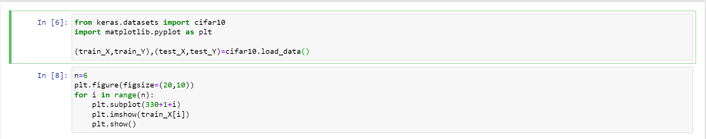
    <br>
 </p>
 <br/>
<p align="center">
    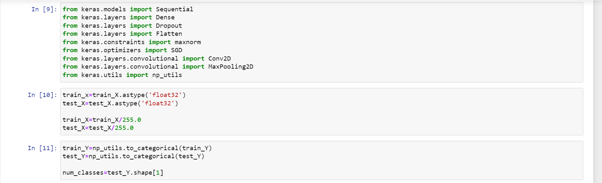
    <br>
 </p>
 <br/>
<p align="center">
    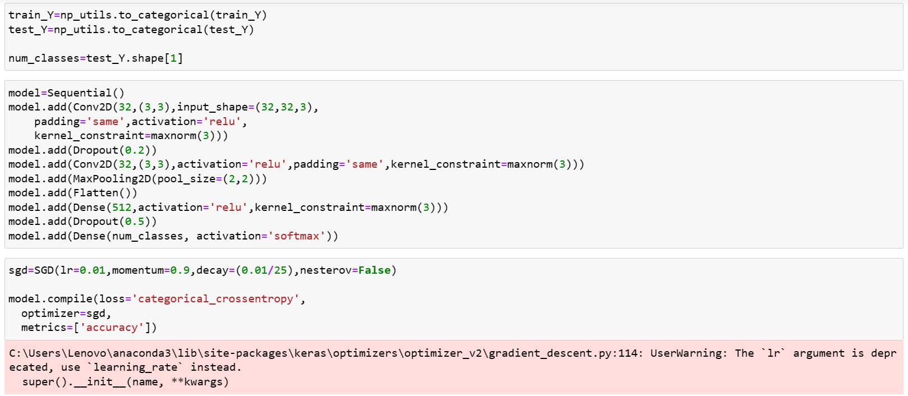
    <br>
 </p>
 <br/>
<p align="center">
    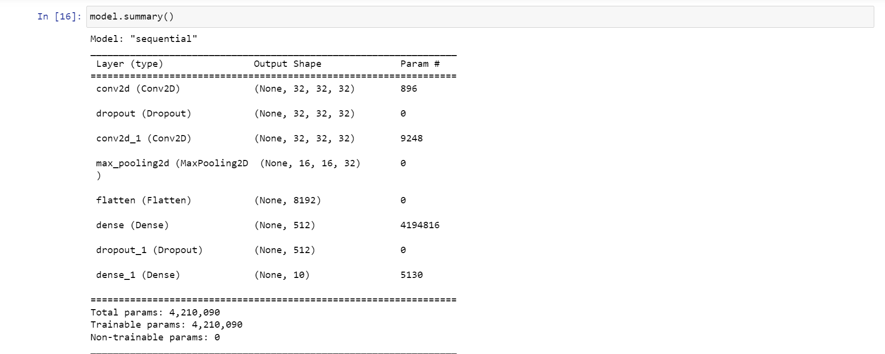
    <br>
 </p>
<br/>
<p align="center">
    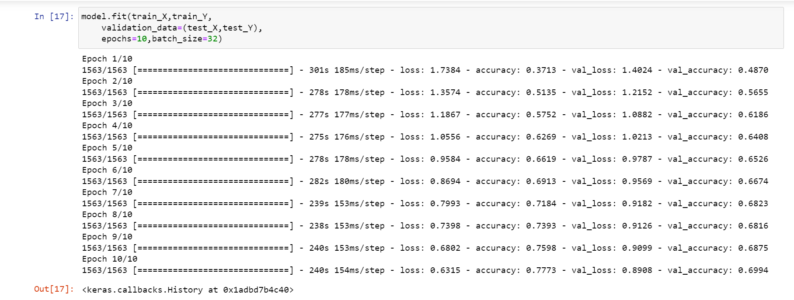
    <br>
 </p>
<br/>
 <p align="center">
    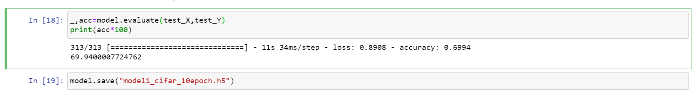
    <br>
 </p>

Bikin file dengan nama apk.py dengan kode

 <p align="center">
    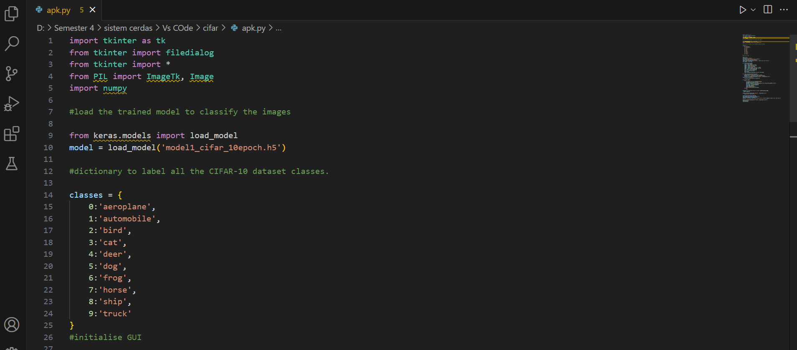
    <br>
 </p>
  <p align="center">
    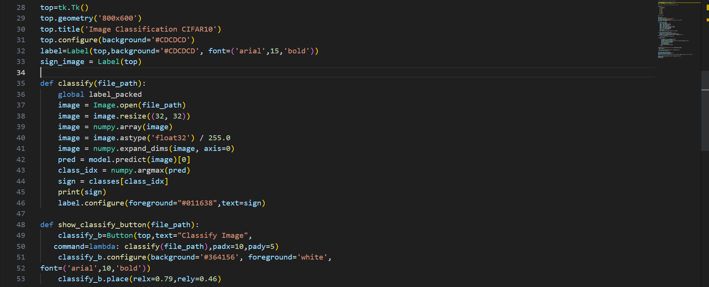
    <br>
 </p>
  <p align="center">
    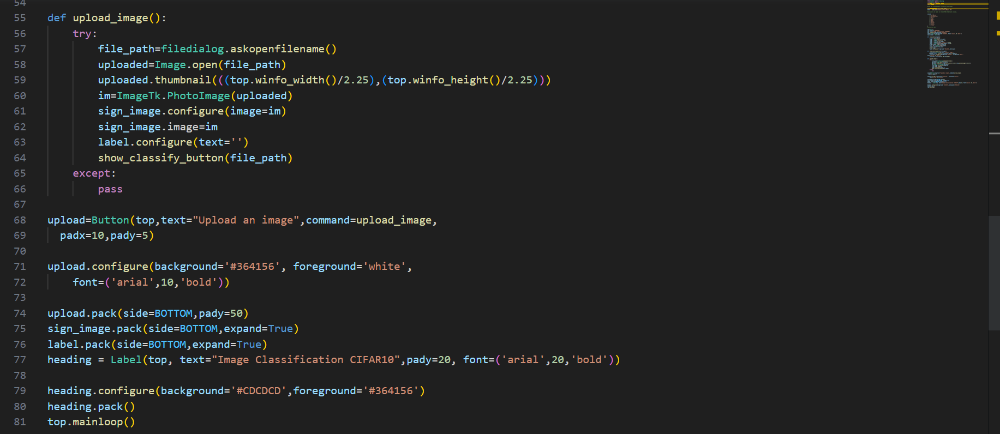
    <br>
 </p>

lalu simpan kedua file dalam folder yang sama

 </p>
  <p align="center">
    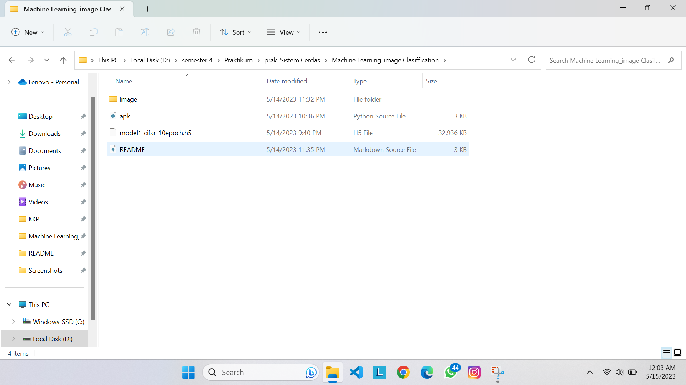
    <br>
 </p>

kemudian run dengan perintah "python apk.py"

 </p>
  <p align="center">
    
    <br>
 </p>

upload image yang akan di klasifikasi

 </p>
  <p align="center">
    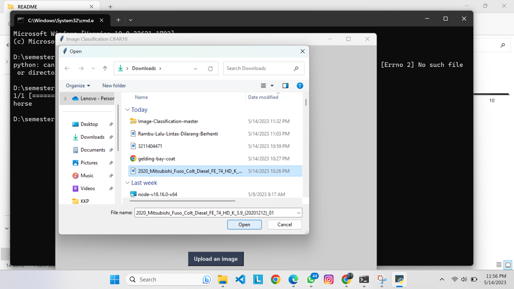
    <br>
 </p>

klik klasifikasi

 </p>
  <p align="center">
    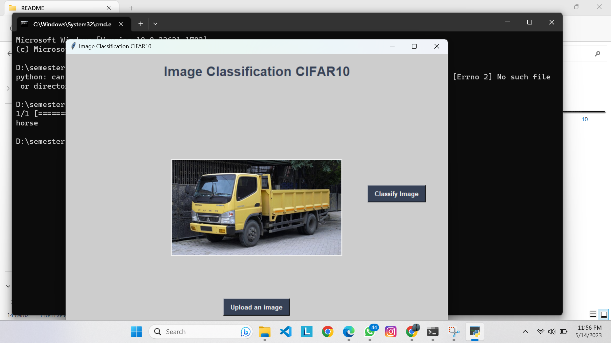
    <br>
 </p>
 <br/>
  </p>
  <p align="center">
    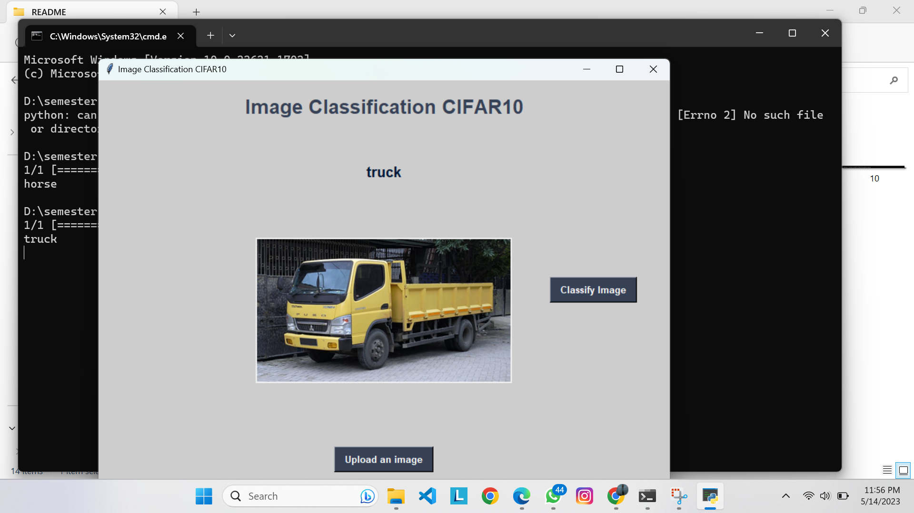
    <br>
 </p>
